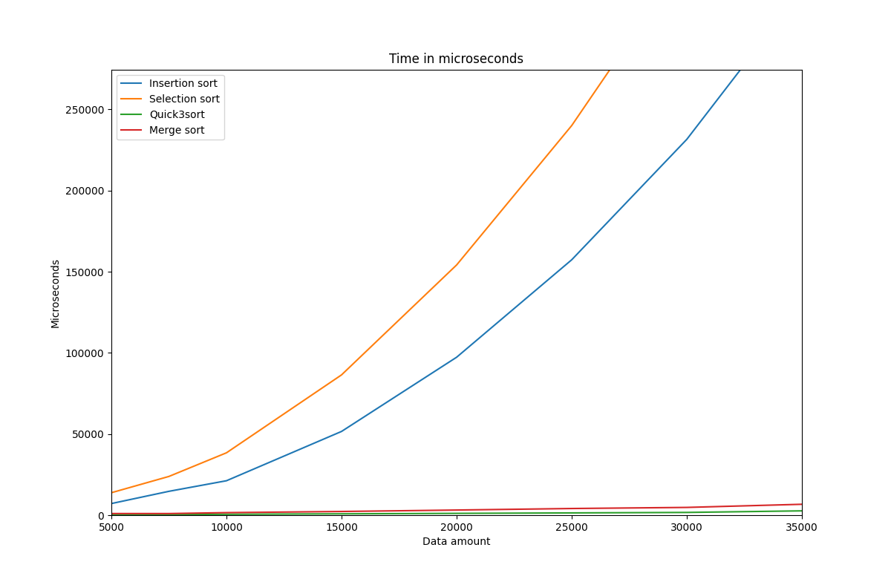

# Minimalistic basic sort and search algorithms in C++



## Requirements
* cmake version >= 3.16
* gcc/g++ version >= 9.0

## Prerequisities
Only if you want to build plotter.
* python3
* matplotlib-cpp library

### matplotlib-cpp library installation
```sh
git clone https://github.com/lava/matplotlib-cpp
mkdir build && cd build
cmake ../ && cmake --build .
make install
```

## Compile
Enter the root directory of the project and do the following:

To compile only group tasks.

```sh
mkdir build && cd build
cmake ../
cmake --build .
```

To compile group tasks and plotter.

```sh
cmake -DBUILD_PLOTTER=ON ../
cmake --build .
```

## Run
From the root directory you can see bin directory. There you can find all executables for each group.
